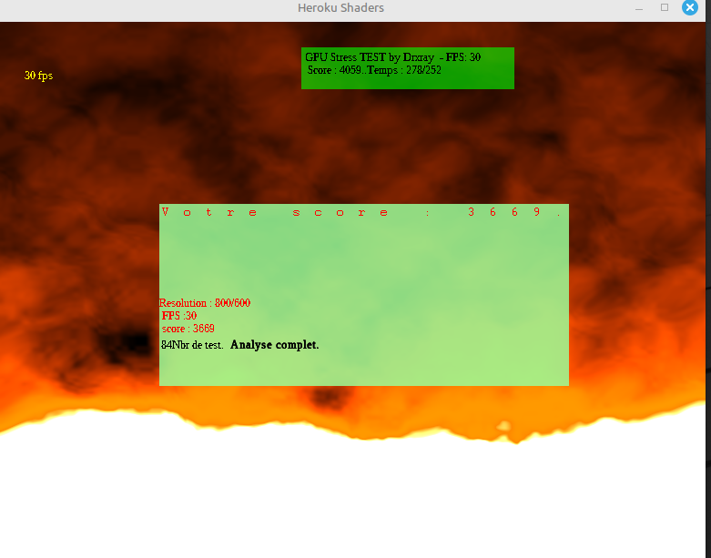
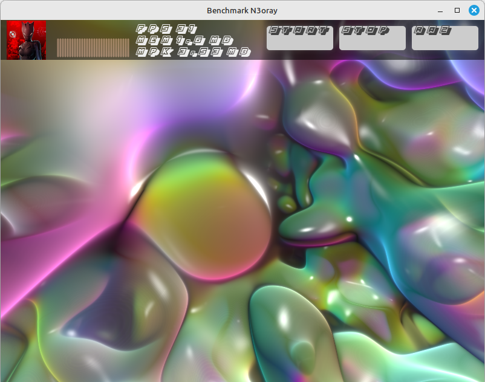
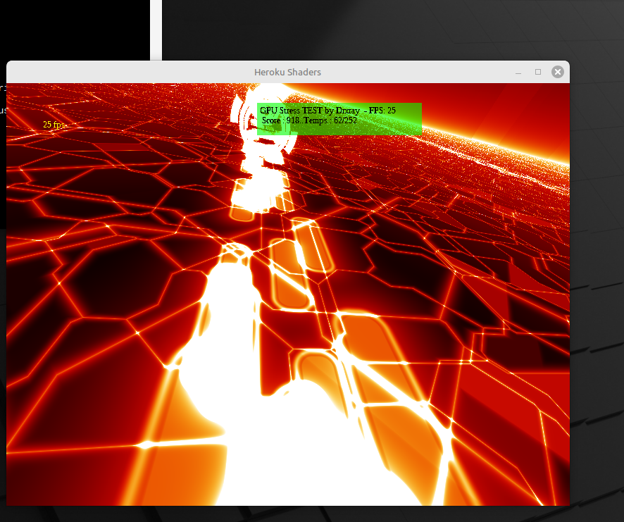

## Prevu
Benchmak-Neko is a flexible console-base OpenGL Sandbox to display 2D/3D GLSL shaders without status pref. 
A place to play with and experiment with GLSL shaders.

  

  

  

  

## Install Haxe
''bash
sudo apt install haxe
''
or

https://haxe.org/download/file/4.3.7/haxe-4.3.7-linux64.tar.gz/

## Clone repository and submodules

git clone https://github.com/N3oRay/Benchmark-Neko.git
cd Benchmark-Neko

## Info
Haxe : https://haxe.org/
These shaders are taken from http://glsl.heroku.com

More source of any "effect" on glsl.heroku.com.
