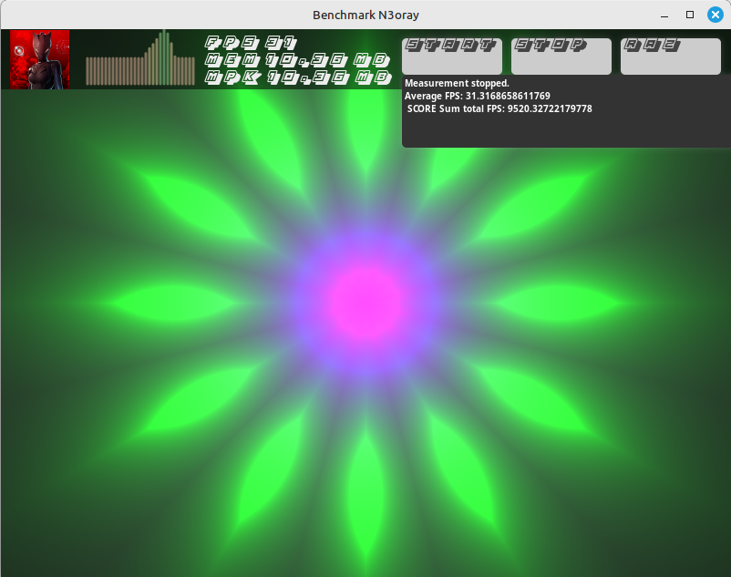

## Prevu
Benchmak-Neko is a flexible console-base OpenGL Sandbox to display 2D/3D GLSL shaders without status pref. 
A place to play with and experiment with GLSL shaders.

  

  

  

  

  

## Install Haxe

sudo apt install haxe

or

https://haxe.org/download/file/4.3.7/haxe-4.3.7-linux64.tar.gz/

## Install & Config on linux

    $sudo haxelib setup

## Install OpenFL

$ haxelib install openfl
$ haxelib run openfl setup
    
#### Install Actuate

$ haxelib install actuate
    
#### Install Lime

$ haxelib install lime

## Build&RUN android

sudo openfl build android

## Build&RUN for HTML5

sudo openfl build html5

## Build&RUN for Linux

sudo openfl build linux

## Build&RUN for Windows

sudo openfl build neko

## Run compile with lime

To compile a Neko application, run lime build neko.

To compile and launch a Neko application with one command, run lime test neko

To compile a Linux executable, run lime build linux. Add the -debug option to create a build that can connect to the HXCPP debugger.

To compile and launch a Linux executable with one command, run lime test linux.

## Clone repository and submodules

git clone https://github.com/N3oRay/Benchmark-Neko.git
cd Benchmark-Neko

## Info
Haxe : https://haxe.org/
These shaders are taken from http://glsl.heroku.com

Openfl :
https://github.com/openfl/openfl

More source of any "effect" on glsl.heroku.com.
